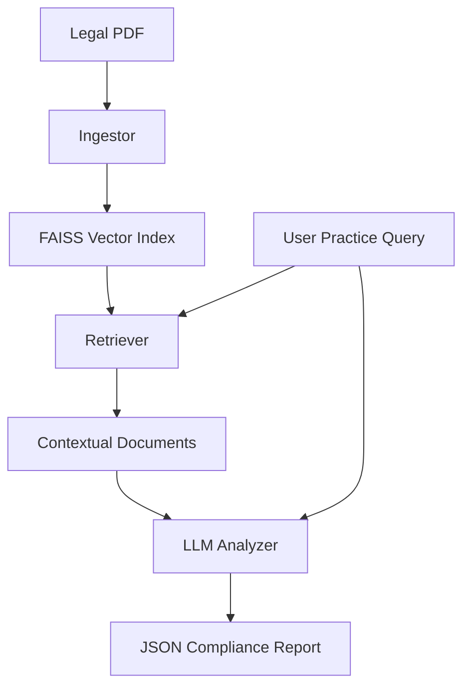

# 🛡️ CCPA Guardian

CCPA Guardian is a production-ready **Retrieval-Augmented Generation (RAG)** system designed to analyze business practices against the California Consumer Privacy Act (CCPA). It leverages local vector storage and large language models (LLMs) to provide citations and compliance reasoning.

## 🏗️ Architecture

The system follows a modular RAG pipeline:

1.  **Ingestion (`ingest.py`)**: Parses the CCPA statute PDF, extracts text, and chunks it into legal sections using regex-based structural analysis.
2.  **Retrieval (`retriever.py`)**: Uses HuggingFace embeddings (`all-MiniLM-L6-v2`) and a **FAISS** vector store to index legal chunks and perform semantic similarity searches.
3.  **Analysis (`analyzer.py`)**: A local LLM engine (defaulting to `Qwen-2.5-1.5B`) that processes the retrieved context and the user query to enforce strict JSON output for compliance results.
4.  **Interface (`main.py` & `run.py`)**: Provides a clean entry point for interactive analysis and batch processing.



## 🚀 Setup Instructions

### 1. Prerequisites
- Python 3.8+
- (Optional) CUDA-enabled GPU for faster inference.

### 2. Installation
Clone the repository and install dependencies:
```bash
pip install -r requirements.txt
```

### 3. Configuration
Copy the environment template and add your HuggingFace token (for model access):
```bash
cp .env.example .env
```

### 4. Data Preparation
Place the CCPA statute PDF in `data/raw/ccpa_statute.pdf`.

## 💻 Usage

Start the interactive compliance analyzer:
```bash
python run.py
```

## 📝 Example

### Sample Input
> "A company collects user IP addresses and browsing history but does not provide a 'Do Not Sell My Personal Information' link on its homepage."

### Expected Output (JSON Format)
```json
{
  "harmful": true,
  "articles": ["Section 1798.120", "Section 1798.135"],
  "reasoning": "The CCPA requires businesses that sell personal information to provide a clear and conspicuous link on the business's Internet homepage, titled 'Do Not Sell My Personal Information'."
}
```

## 📁 Project Structure

```text
.
├── ccpa_guardian/         # Core package
│   ├── __init__.py
│   ├── analyzer.py        # LLM Logic
│   ├── config.py          # Configuration management
│   ├── ingest.py          # Document parsing
│   ├── main.py            # App logic
│   └── retriever.py       # FAISS search
├── data/
│   ├── raw/               # Input PDFs
│   └── processed/         # FAISS indices
├── static/                # UI assets (optional)
├── .env.example           # Environment template
├── README.md              # Documentation
├── requirements.txt       # Dependencies
└── run.py                 # Main entry point
```